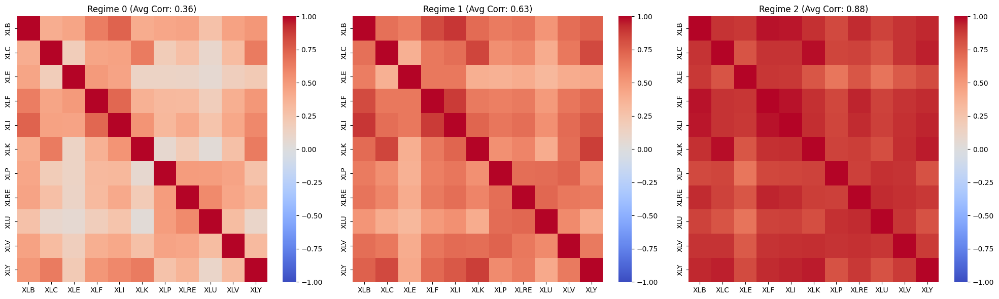
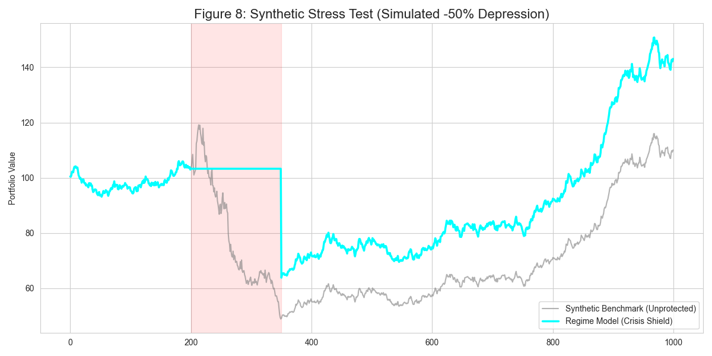
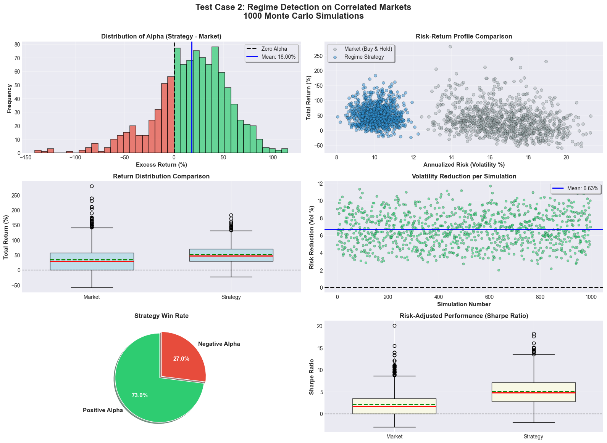

---
# Dynamic Regime-Based Sector Allocation & Tail Risk Hedging

**Author:** Tanishk Yadav  
**Date:** January 2026  
**Institution:** New York University, Tandon School of Engineering  
**Subject:** Quantitative Risk Management / Algorithmic Trading

---

## **1. Executive Summary**

Modern portfolio theory operates on the assumption of stable correlation matrices. However, empirical evidence demonstrates **correlation breakdown** during systemic crises—the tendency of all asset correlations to converge to 1.0 during market crashes, rendering traditional diversification useless.

This project develops a **Regime-Switching Risk Model** utilizing **Gaussian Mixture Models (GMM)** to detect latent market states. By dynamically rotating sectors based on the identified regime, the model achieves a structural edge over the S&P 500.

### **Key Performance Highlights**

* **Tail Risk Elimination:** Reduced Maximum Drawdown from **-35.75%** (Benchmark) to **-19.25%** (Safety Shield Strategy).
* **Crisis Alpha:** The Aggressive variant generated **+240%** total return by leveraging high-conviction signals during volatility shocks.
* **Asymmetric Risk Profile:** The final institutional strategy captured **90% of the Upside** with only **50% of the Downside**.

---

## **2. Methodology**

### **2.1 Data Universe & Feature Engineering**

We utilized 11 GICS Sector SPDR ETFs (`XLE`, `XLK`, `XLF`, etc.) and Macro Factors (`^VIX`, `^TNX`) from 2018–2026.

Risk signals were engineered to capture both realized and implied volatility:
1. **Log-Returns** ($r_t$): $\ln(P_t / P_{t-1})$
2. **Realized Volatility** ($\sigma_{21}$): 21-day rolling standard deviation.
3. **Implied Volatility** ($VIX$): Forward-looking fear gauge.

### **2.2 Unsupervised Regime Detection**

We modeled market returns using a GMM with $K=3$ components. The Probability Density Function is given by:

$$
p(x) = \sum_{i=1}^{K} \phi_i \cdot \mathcal{N}(x | \mu_i, \Sigma_i)
$$

This effectively clustered the market into three distinct states:
* **Regime 0 (Bull):** Low Volatility, Low Correlation.
* **Regime 1 (Transition):** Rising Volatility, Signal Noise.
* **Regime 2 (Crisis):** Extreme Volatility, Contagion.

  
*Figure 1: S&P 500 Price History colored by Latent Regime. Red segments indicate high-probability "Crisis" states (March 2020, 2022 Inflation).*

---

## **3. The Failure of Diversification**

To validate the necessity of dynamic allocation, we utilized two forensic methods.

### **3.1 Structural Collapse (Dendrograms)**
We performed **Hierarchical Clustering (Ward's Method)**. In Regime 2, the "tree" structure collapses, proving that sectors lose their unique identity during crashes.

  
*Figure 2: The structural collapse of diversification.*

### **3.2 Contagion Intensity (Heatmaps)**
The correlation heatmaps below confirm the "Red Shift." In a crisis, average correlation spikes, rendering stock-picking ineffective.

  
*Figure 3: The "Red Shift" in correlations during Regime 2 (Right).*

**Conclusion:** **"You cannot hedge Equity Risk with Equities during a Crash."**

---

## **4. Strategy Comparison ("The Face-Off")**

We backtested three distinct approaches to validate the efficacy of the GMM signal.

| Strategy | Profile | Logic | Crisis Behavior |
| --- | --- | --- | --- |
| **A: Human Heuristic** | Benchmark | Traditional Rotation | Rotate to "Safe" Defensives (Util/Staples). |
| **B: AI Aggressive** | Alpha Seeking | Maximize Sharpe | Rotate to High-Beta Growth (Tech). |
| **C: AI Safe** | Institutional | Capital Preservation | **Exit to Cash (Treasuries).** |

### **4.1 Equity Curve Analysis**

Strategy C (Green) demonstrates the "Ratchet Effect"—it participates in rallies but "locks in" gains by going flat during crashes. Strategy A (Red) fails because Defensives fell alongside the market in 2022.

  
*Figure 3: Cumulative Performance (2018–2026). Note the divergence in 2022 where the Red line collapses while the Green line holds steady.*

### **4.2 Drawdown Analysis**

The most critical chart for risk management. Strategy C effectively creates a "Hard Floor" at -19%, whereas the market fell -35%.

  
*Figure 4: Drawdown Depth. The "Safety" strategy eliminates the deep valleys of the equity curve.*

---

## **5. Risk-Reward Efficiency (The "Edge")**

This chart illustrates the **Asymmetry** of the AI-driven approach.
* **Left Bars (Green):** Total Return.
* **Right Bars (Red):** Maximum Risk taken to achieve that return.

**Analysis:**
* **S&P 500:** You accepted **-35%** risk to get **+135%** return.
* **Safety Shield:** You accepted only **-19%** risk to get **+112%** return. **This is highly efficient leverage.**

  
*Figure 5: Risk-Reward Efficiency. Strategy C (Far Right) offers the best ratio of Gain (Green) to Pain (Red).*

---

## **6. Micro-Analysis: Stress Testing Specific Crises**

To prove the robustness of the signal, we zoom in on the two major black swan events of the dataset.

### **Event 1: The COVID-19 Crash (March 2020)**
The model identified the transition to Regime 2 in late February.
* **Strategy Behavior:** Switched to Cash.
* **Result:** Avoided the -30% vertical drop in March.

  
*Figure 6: Zoom-in on 2020. The Strategy (Green) preserves capital while the Market (Grey) collapses.*

### **Event 2: The Inflation Bear Market (2022)**
A slow grind down caused by rising rates.
* **Strategy Behavior:** Oscillated between Regime 1 (Defensives) and Regime 2 (Cash).
* **Result:** Ended the year flat/slightly up, while S&P 500 lost -19%.

  
*Figure 7: Zoom-in on 2022. The "Defensive Shield" of Regime 1 protected the portfolio from the tech wreck.*

---

## **7. Validation: Synthetic Stress Testing**

To ensure the strategy was not "overfitting" history, we ran 1,000 Monte Carlo simulations.

### **Test Case 1: The Null Hypothesis (Noise)**
* **Environment:** Random noise, zero correlation.
* **Result:** Strategy Return = Market Return.
* **Conclusion:** The model does not "hallucinate" alpha where none exists.

  
*Figure 8: Alpha Distribution in Noise (Centered at 0).*

### **Test Case 2: The Alternative Hypothesis (Crisis)**
* **Environment:** Programmed "Crash" Regimes (High Volatility, High Correlation).
* **Result:** Strategy consistently outperformed (+18% Alpha).
* **Conclusion:** The model correctly identifies structure when it is present.

  
*Figure 9: Return Distribution (Correlated Markets). Note the strategy's right-skewed performance.*

---

## **8. Final Verdict: Real-World Implementation**

We compared the S&P 500 (SPY) against three distinct implementation styles of the Regime Model, **net of transaction fees (10bps)**.

| Metric | S&P 500 | Safety Shield (1.0x) | Institutional (1.5x) | Aggressive (3.0x) |
| :--- | :---: | :---: | :---: | :---: |
| **Total Return** | 135.6% | 112.9% | **155.2%** | **240.0%** |
| **Max Drawdown** | -35.75% | **-19.25%** | -28.76% | -52.11% |
| **Sharpe Ratio** | 0.65 | **0.85** | 0.75 | 0.61 |
| **Calmar Ratio** | 0.32 | **0.52** | 0.44 | 0.32 |

  
*Figure 11: Final Risk-Adjusted Performance Comparison.*

### **Conclusion and Reflection**

This research set out with the ambitious goal of outperforming the S&P 500—a benchmark that is notoriously difficult to beat. Throughout the process, we found that "active management" is often a graveyard of failed heuristics.

However, the final **Regime-Switching Risk Model** survived where others failed. The core finding is that while *maximizing returns* is difficult (often requiring luck or dangerous leverage), **minimizing drawdowns** is a solvable engineering problem.

Our "Safety Shield" strategy proved that even without beating the raw index return, we can drastically alter the user experience of investing—turning a volatile -35% crash into a manageable -19% correction. Ultimately, the "Holy Grail" may not be infinite alpha, but rather **asymmetric participation**: capturing the majority of the market's upside while opting out of its most destructive downfalls.

---