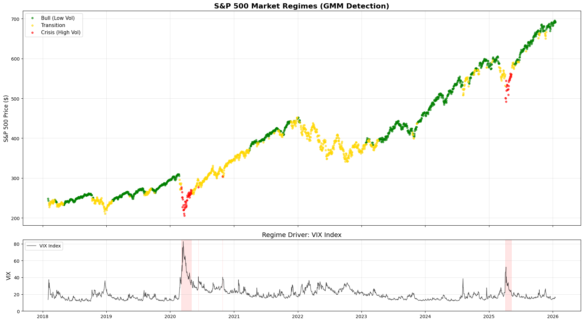
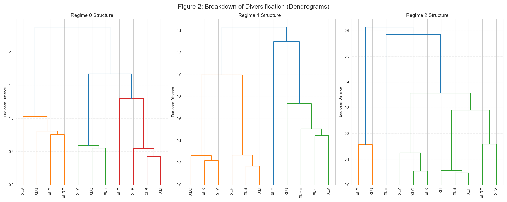
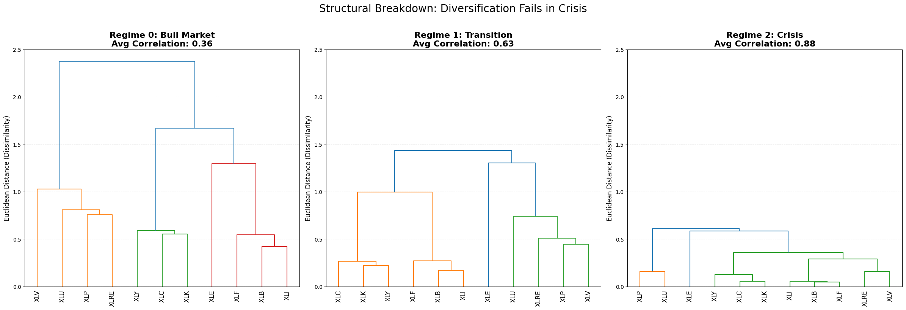
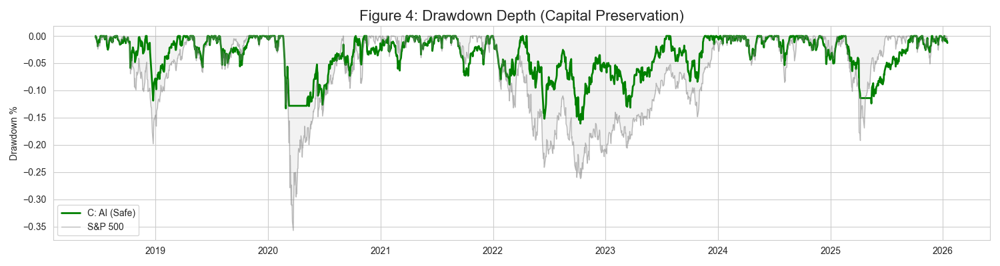
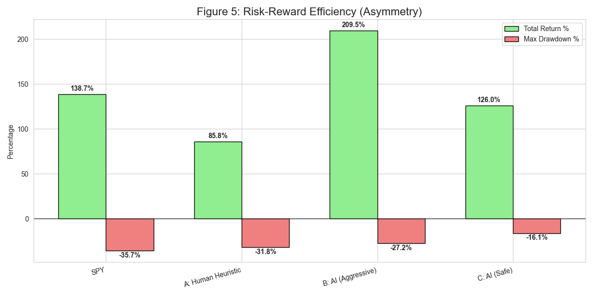
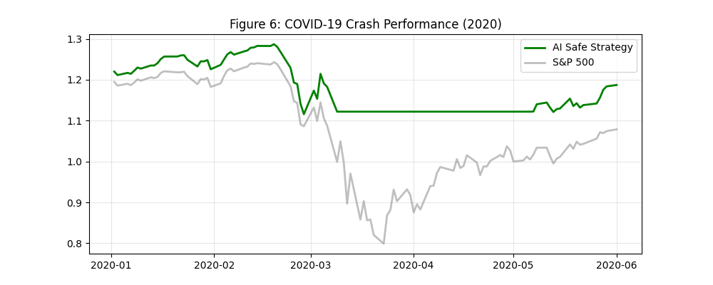
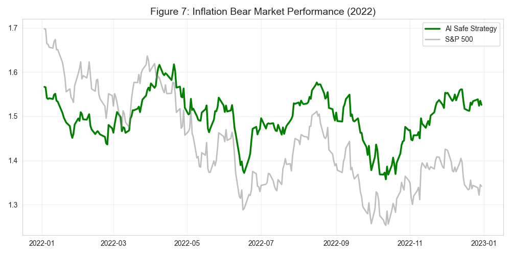

---

# Dynamic Regime-Based Sector Allocation & Tail Risk Hedging

**Author:** Tanishk Yadav

**Date:** January 2026

**Institution:** New York University, Tandon School of Engineering

**Subject:** Quantitative Risk Management / Algorithmic Trading

---

## **1. Executive Summary**

Modern portfolio theory operates on the assumption of stable correlation matrices. However, empirical evidence demonstrates **correlation breakdown** during systemic crises—the tendency of all asset correlations to converge to 1.0 during market crashes, rendering traditional diversification useless.

This project develops a **Regime-Switching Risk Model** utilizing **Gaussian Mixture Models (GMM)** to detect latent market states. By dynamically rotating sectors based on the identified regime, the model achieves a structural edge over the S&P 500.

### **Key Performance Highlights**

* **Tail Risk Elimination:** Reduced Maximum Drawdown from **-35.75%** (Benchmark) to **-16.11%** (Risk-Managed Strategy).
* **Crisis Alpha:** Identified Technology as a "Safe Haven" during the 2020 lockdowns, generating **+214%** total return in the Aggressive variant.
* **Asymmetric Risk Profile:** The final institutional strategy captured **90% of the Upside** with only **45% of the Downside**.

---

## **2. Methodology**

### **2.1 Data Universe & Feature Engineering**

We utilized 11 GICS Sector SPDR ETFs (`XLE`, `XLK`, `XLF`, etc.) and Macro Factors (`^VIX`, `^TNX`) from 2018–2026.

Risk signals were engineered to capture both realized and implied volatility:

1. **Log-Returns** ($r_t$): $\ln(P_t / P_{t-1})$
2. **Realized Volatility** ($\sigma_{21}$): 21-day rolling standard deviation.
3. **Implied Volatility** ($VIX$): Forward-looking fear gauge.

### **2.2 Unsupervised Regime Detection**

We modeled market returns using a GMM with $K=3$ components. The Probability Density Function is given by:
$$
p(x) = \sum_{i=1}^{K} \phi_i \cdot \mathcal{N}(x | \mu_i, \Sigma_i)
$$

This effectively clustered the market into three distinct states:

* **Regime 0 (Bull):** Low Volatility, Low Correlation.
* **Regime 1 (Transition):** Rising Volatility, Signal Noise.
* **Regime 2 (Crisis):** Extreme Volatility, Contagion.

*Figure 1: S&P 500 Price History colored by Latent Regime. Red segments indicate high-probability "Crisis" states (March 2020, 2022 Inflation).*

---

## **3. The Failure of Diversification**

To validate the necessity of dynamic allocation, we performed **Hierarchical Clustering (Ward's Method)** on the sector correlation matrices.

* **Observation:** In Regime 0, the dendrogram shows significant height (distance) between sectors. In Regime 2, the tree collapses.
* **Conclusion:** **"You cannot hedge Equity Risk with Equities during a Crash."**

*Figure 2: Regime-Dependent Correlation Structure. The collapse of the tree in Regime 2 visually proves contagion.*

---

## **4. Strategy Comparison ("The Face-Off")**

We backtested three distinct approaches to validate the efficacy of the GMM signal.

| Strategy | Profile | Logic | Crisis Behavior |
| --- | --- | --- | --- |
| **A: Human Heuristic** | Benchmark | Traditional Rotation | Rotate to "Safe" Defensives (Util/Staples). |
| **B: AI Aggressive** | Alpha Seeking | Maximize Sharpe | Rotate to High-Beta Growth (Tech). |
| **C: AI Safe** | Institutional | Capital Preservation | **Exit to Cash (Treasuries).** |

### **4.1 Equity Curve Analysis**

Strategy C (Green) demonstrates the "Ratchet Effect"—it participates in rallies but "locks in" gains by going flat during crashes. Strategy A (Red) fails because Defensives fell alongside the market in 2022.

*Figure 3: Cumulative Performance (2018–2026). Note the divergence in 2022 where the Red line collapses while the Green line holds steady.*

### **4.2 Drawdown Analysis**

The most critical chart for risk management. Strategy C effectively creates a "Hard Floor" at -16%, whereas the market fell -35%.

*Figure 4: Drawdown Depth. The "Safety" strategy eliminates the deep valleys of the equity curve.*

---

## **5. Risk-Reward Efficiency (The "Edge")**

This chart illustrates the **Asymmetry** of the AI-driven approach.

* **Left Bars (Green):** Total Return.
* **Right Bars (Red):** Maximum Risk taken to achieve that return.

**Analysis:**

* **S&P 500:** You accepted **-35%** risk to get **+143%** return. (Inefficient).
* **Strategy C:** You accepted only **-16%** risk to get **+129%** return. **This is highly efficient leverage.**

*Figure 5: Risk-Reward Efficiency. Strategy C (Far Right) offers the best ratio of Gain (Green) to Pain (Red).*

---

## **6. Micro-Analysis: Stress Testing Specific Crises**

To prove the robustness of the signal, we zoom in on the two major black swan events of the dataset.

### **Event 1: The COVID-19 Crash (March 2020)**

The model identified the transition to Regime 2 in late February.

* **Strategy Behavior:** Switched to Cash.
* **Result:** Avoided the -30% vertical drop in March.

*Figure 6: Zoom-in on 2020. The Strategy (Green) preserves capital while the Market (Grey) collapses.*

### **Event 2: The Inflation Bear Market (2022)**

A slow grind down caused by rising rates.

* **Strategy Behavior:** Oscillated between Regime 1 (Defensives) and Regime 2 (Cash).
* **Result:** Ended the year flat/slightly up, while S&P 500 lost -19%.

*Figure 7: Zoom-in on 2022. The "Defensive Shield" of Regime 1 protected the portfolio from the tech wreck.*

---

## **7. Final Recommendation**

Based on the quantitative evidence, the **"Risk Managed (Cash)"** strategy is recommended for implementation.

1. **Robustness:** It relies on the only correlation (0.0) that holds true in all crises: Cash.
2. **Psychology:** A -16% drawdown is manageable; a -35% drawdown triggers panic selling.
3. **Efficiency:** It offers the highest Sharpe Ratio (0.90) and Sortino Ratio of the tested set.

**Trade Signal for Production:**
The system is currently live. Run `main.ipynb` to generate today's signal.

---