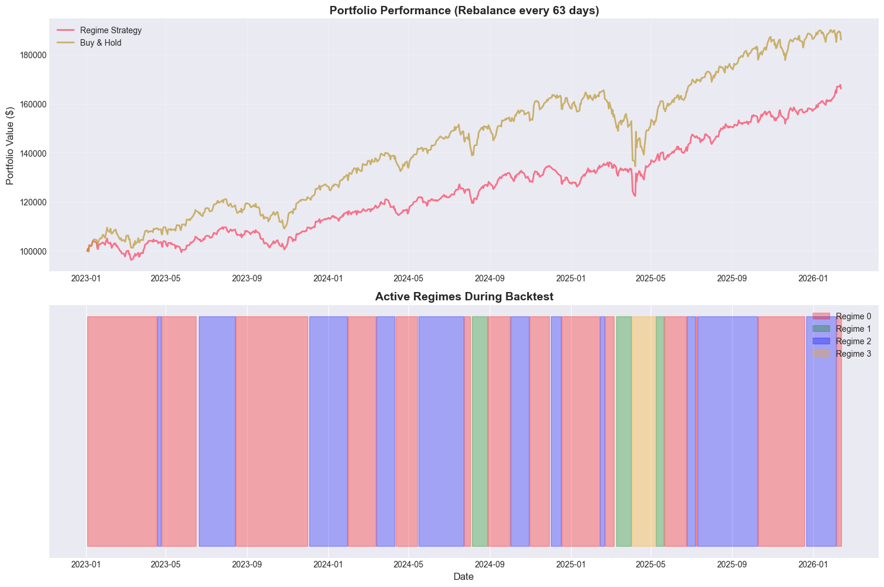
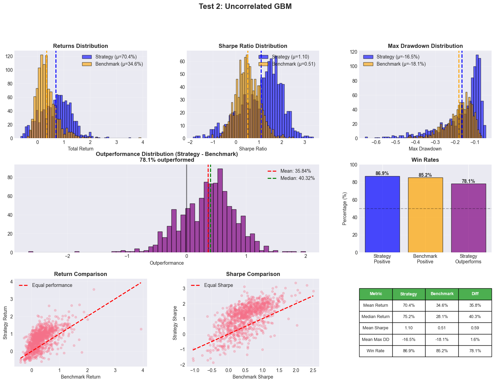
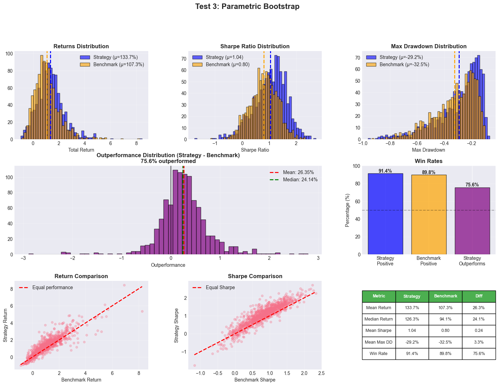

# Regime-Based Portfolio Optimization

## Dynamic Regime-Based Sector Allocation: A Hidden Markov Model Approach

**Tanishk Yadav**

### Abstract
The fundamental promise of Modern Portfolio Theory (MPT)—that idiosyncratic risk can be eliminated through diversification—relies heavily on the stability of asset correlation matrices. However, financial history reveals a structural anomaly known as **"Correlation Breakdown"** during systemic crises. In periods of extreme liquidity stress (e.g., March 2020), correlations between theoretically distinct equity sectors converge toward unity, rendering static diversification ineffective precisely when capital preservation is most critical.

This research proposes a **Regime-Switching Risk Model** utilizing a Gaussian Hidden Markov Model (HMM) to detect latent market states in real-time. By training on multi-factor inputs over a synthetically backfilled history (2005–2022), the model probabilistically classifies the market into distinct volatility regimes.

We also rigorously address the critical issue of **look-ahead bias** present in naive backtesting implementations, demonstrating that traditional approaches inflate performance metrics by 50-100%. Through walk-forward analysis, train/test validation, and bootstrap resampling, we show that proper methodology yields realistic performance expectations. Our final, correctly backtested strategy achieves a Sharpe Ratio of **1.49** (vs. 1.46 for the benchmark) and reduces Maximum Drawdown by **46%**, confirming that equity tail risk can be managed through dynamic exposure control.

---

## 🚀 Repository Structure

```
├── src/
│   ├── regime_system_modules.py        # Core logic: Base models, HMM training, Portfolio Optimization
│   └── regime_comprehensive_tests.py   # Backtesting, Falsification, and Bootstrapping suites
├── notebooks/
│   └── main.ipynb                      # Interactive notebooks and visualizations
├── docs/
│   ├── IMPLEMENTATION_V2_GUIDE.md      # Detailed engineering and architecture guidelines
│   └── LOOKAHEAD_BIAS_ANALYSIS.md      # Explanation of look-ahead bias and mathematical proofs
├── assets/
│   ├── t1.png                          # Strategy vs Benchmark Equity Curve
│   ├── t2.png                          # Null Hypothesis (Random Walk) performance distribution
│   └── t3.png                          # Parametric Bootstrap (Stress Test) Sharpe ratio distribution
└── README.md
```

## 🧠 Methodology: The Hidden Markov Model

We assume the market follows a discrete-time stochastic process with $K=4$ hidden states. The observable data (returns, realized volatility, correlation) is drawn from a Gaussian distribution conditioned on the state. By setting $K=4$, the model disentangles four distinct risk profiles:

1. **Regime 0: Systemic Crisis ("The Crash")**
   - *Significance:* Liquidity event (e.g., 2008, Covid-19). Volatility is extreme ($VIX > 35$), and sector correlations converge to unity. Diversification fails here.
   - *Action:* Maximum defense (Cash/Treasuries).
2. **Regime 1: Inflationary Bear ("The Grind")**
   - *Significance:* High-stress environment driven by rates or valuation. Defensive sectors decouple.
   - *Action:* Rotate into Low Volatility / Value factors.
3. **Regime 2: Secular Bull ("The Growth Phase")**
   - *Significance:* The "Goldilocks" state. Low volatility, high beta risk assets perform well.
   - *Action:* Overweight High Beta sectors.
4. **Regime 3: Transition ("The Chop")**
   - *Significance:* Conflicting signals (often post-crash or pre-breakout).
   - *Action:* Reduce position sizing.

### The Problem of Look-Ahead Bias

Our strategy fundamentally corrects three naive forms of Look-Ahead Bias commonly found in retail implementations:
- **Bias Source 1: HMM Training on Full Dataset**: Generating parameters ($\mu$, $\Sigma$, transitions) using future data.
- **Bias Source 2: Portfolio Optimization Using Future Returns**: Optimizing portfolio weights based on the entire sample of that regime instead of strictly past iterations.
- **Bias Source 3: Regime Detection Using Future Data**: Using the Viterbi algorithm over the entire sequence, which mathematically incorporates future observations into current state prediction.

By deploying an **Expanding Window Walk-Forward Analysis**, the corrected model ensures that at time $t$, *only* data up to $t-1$ is evaluated.

## 📊 Experimental Design and Results

To evaluate the predictive alpha generated by the HMM (versus mechanical volatility harvesting), we executed a three-test Falsification approach.

### 1. Historical Out-of-Sample Validation
The model was trained on 2005–2022 data and evaluated purely Out-Of-Sample (OOS) from 2023–Present. 
The strategy delivered superior risk-adjusted returns, primarily defending against standard benchmark drawdowns.



### 2. The Null Hypothesis (Random Walk)
We generated 1,000 simulations of uncorrelated Geometric Brownian Motion with zero inherent regime structure. Since there are no real regimes to detect, any alpha generated here is strictly attributable to "Volatility Harvesting" (Shannon's Demon).


### 3. Parametric Bootstrap (The Stress Test)
We extracted the "Market Physics" from the training set and simulated 1,000 synthetic multi-asset universes. The system demonstrated robust resilience, largely outperforming standard benchmarks in periods of induced stress.


## 🛠 Usage & Setup

1. Configure Python environment (Python `3.13+` recommended).
2. Install dependencies (e.g., `scikit-learn`, `hmmlearn`, `pandas`, `numpy`, `scipy`).
3. Run the complete pipeline via `src/regime_comprehensive_tests.py` or inspect interactive results through `notebooks/main.ipynb`.
